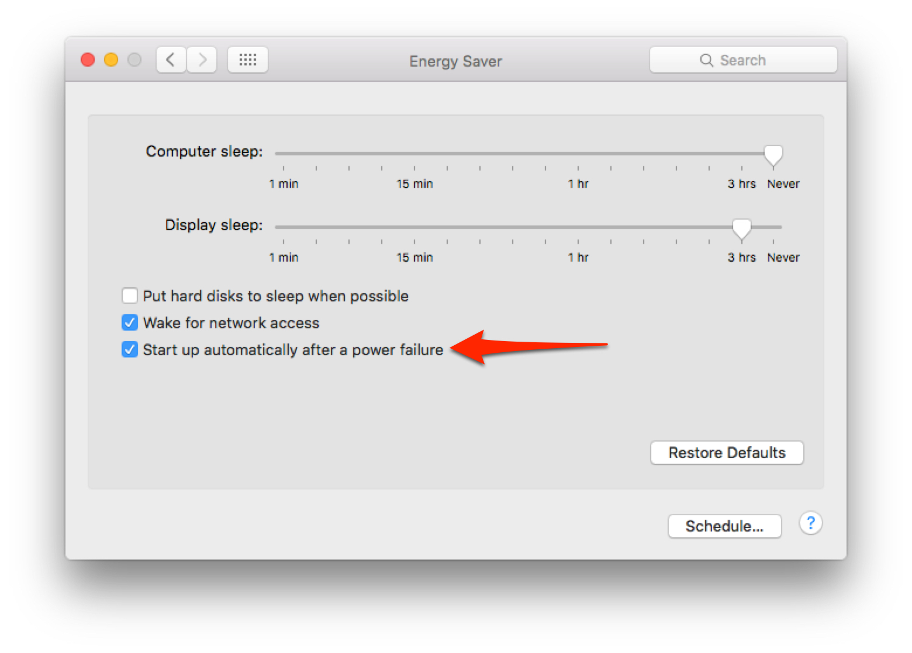

# restartpowerfailure

Purpose: This script will install a launchd plist to check to make sure that the Mac is set to restart automatically after a power failure

OS X has a setting which is designed to automatically restart a Mac if the power goes out. However, for some reason this 
feature keeps getting set to “off” even after the user has set it “on”. In order to alleviate that problem, this script (and a launchd plist)
will check periodically to make sure that the setting has not been turned “off” and if it has been, then it will be turned back on. 

_Note:_ some Macs, such as the MacBook (Retina, 12-inch, Early 2015), do not support this feature. Look for a setting in **System Preferences.app** under “Energy Saver” for a setting like the one shown above.

## Requires Administrator Permissions

Due to OS X’s requirements, this script must be run as an administrator (which is accomplished using 'sudo' even if the user forgets).

## License and (Lack of) Warranty 

This script and its related plist are released free of charge for anyone to use, modify, and change it in any way they see fit.
All I ask if that my name be listed as a contributor and a link to the original at https://github.com/tjluoma/restartpowerfailure be included. 

***This script comes without any guarantee/warranty/etc, expressed or implied.***

Use at your own risk.

## How to install/run

1.	Launch "/Applications/Utilities/Terminal.app" 

2.	Copy and paste this line:

	/bin/zsh -c "$(curl -fsSL https://raw.githubusercontent.com/tjluoma/restartpowerfailure/master/install.sh)"

(If you want to see what this is going to do, take a look at <https://github.com/tjluoma/restartpowerfailure/blob/master/install.sh>).
